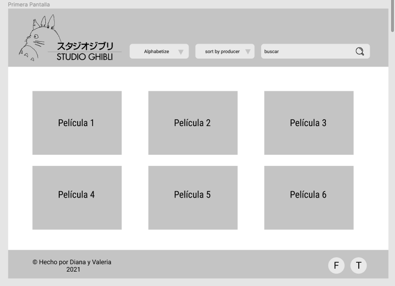
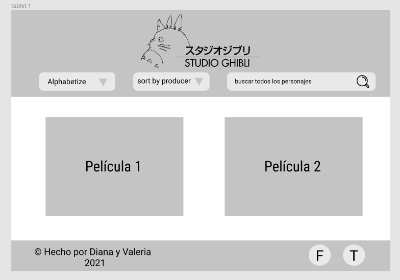
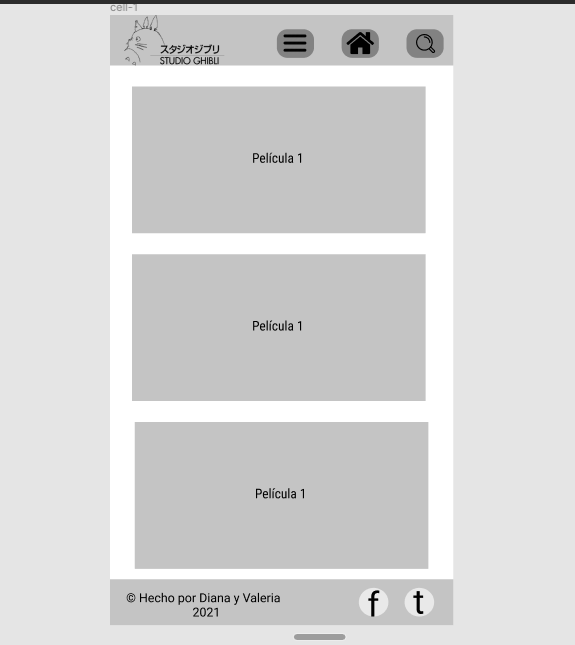
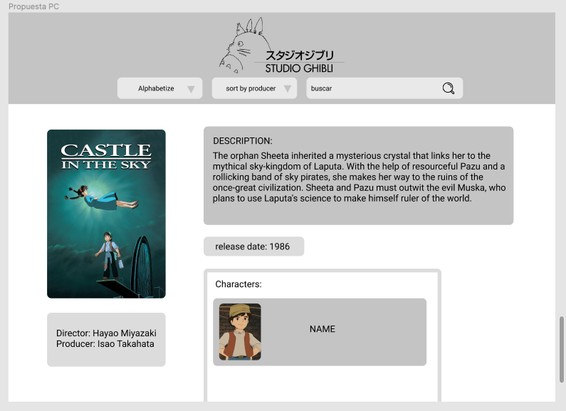

# Data Lovers (Studio Ghibli)

## Índice
* [1. Definición del producto](#1-Definición-del-producto)
* [2. Historias de usuario](#2-Historias-de-usuario)
* [3. Prototipo de Baja Fidelidad](#3-Prototipo-de-baja-fidelidad)
* [4. Diseño de la Interfaz de Usuario](#4-Diseño-de-la-interfaz-de-usuario)
* [5. Objetivos de Aprendizaje](#5-Objetivos-de-aprendizaje)

***

## 1. Definición del producto
Escogimos colores pasteles porque son los que predominan en los paisajes de las películas de Estudio Ghibli.

Esta página web fue creada para que los fanáticos del anime puedan visualizar, filtrar y ordenar las películas de Estudio Ghibli y la información sobre las mismas.

Incluímos los pósters, descripciones, directores, productores, fechas de lanzamiento, personajes, locaciones y vehículos de cada peícula.

## 2. Historias de usuario

### HU1
* Como: Fanático de las películas de Studio Ghibli.

* Quiero: Visualizar en pantalla todas las películas. 

* Para: Escoger la que más me llame la atención.

### HU2
* Como: Fanático de las películas de Studio Ghibli.

* Quiero: Tener a mi alcance las redes sociales del Studio Ghibli.

* Para: Ingresar a la que más uso.

### HU3
* Como: Fanático de las películas de Studio Ghibli.

* Quiero: Visualizar las películas filtradas por director o año. 

* Para: Ver específicamente la información que busco.

### HU4
* Como: Fanático de las películas de Studio Ghibli.

* Quiero: Buscar las películas por nombre.

* Para: Encontrarlas más rápido.

### HU5
* Como: Fanático de las películas de Studio Ghibli.

* Quiero: Organizar las películas de la A-Z o de la Z-A. 

* Para: Ver las películas organizadas.

### HU6
* Como: Fanático de las películas de Studio Ghibli.

* Quiero: Ver la información de cada película

* Para: Poder leer la descripción, ver el autor, el poster, los personajes, etc)

### HU7
* Como: Fanático de las películas de Studio Ghibli.

* Quiero: Que la página sea responsive.

* Para: Poder ingresar desde cualquier dispositivo.

## 3. Prototipo de Baja Fidelidad

### Pantalla principal para pc:

### Pantalla principal para tablet:

### Pantalla principal para celular:

### Pantalla de cada película para pc:

## 4. Diseño de la Interfaz de Usuario

## 5. Objetivos de Aprendizaje

### HTML y CSS

* [ ] Uso de HTML semántico
* [ ] Uso de selectores de CSS.
* [ ] Construir tu aplicación respetando el diseño realizado (maquetación).
* [ ] Uso de flexbox en CSS.

### DOM y Web APIs

* [ ] Uso de selectores del DOM
* [ ] Manejo de eventos del DOM.
* [ ] Manipulación dinámica del DOM.
(appendChild |createElement | createTextNode| innerHTML | textContent | etc.)

### JavaScript

* [ ] Uso de condicionales (if-else | switch | operador ternario)
* [ ] Uso de bucles (for | for..in | for..of | while)
* [ ] Uso de funciones (parámetros | argumentos | valor de retorno)
* [ ] Manipular arrays (filter | map | sort | reduce)
* [ ] Manipular objects (key | value)
* [ ] Uso ES modules(`import` | `export`)
* [ ] Diferenciar entre expression y statements.
* [ ] Diferenciar entre tipos de datos atómicos y estructurados.

### Testing

* [ ] Testeo unitario.

### Estructura del código y guía de estilo

* [ ] Organizar y dividir el código en módulos (Modularización)
* [ ] Uso de identificadores descriptivos (Nomenclatura | Semántica)
* [ ] Uso de linter (ESLINT)

### Git y GitHub

* [ ] Uso de comandos de git (add | commit | pull | status | push)
* [ ] Manejo de repositorios de GitHub (clone | fork | gh-pages)
* [ ] Colaboración en Github (branches | pull requests | | [tags](https://git-scm.com/book/en/v2/Git-Basics-Tagging))

### UX

* [ ] Diseñar la aplicación pensando y entendiendo al usuario.
* [ ] Crear prototipos para obtener feedback e iterar.
* [ ] Aplicar los principios de diseño visual (contraste, alineación, jerarquía)
* [ ] Planear y ejecutar tests de usabilidad.
